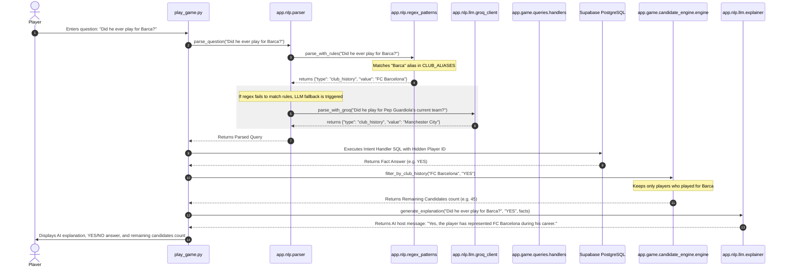
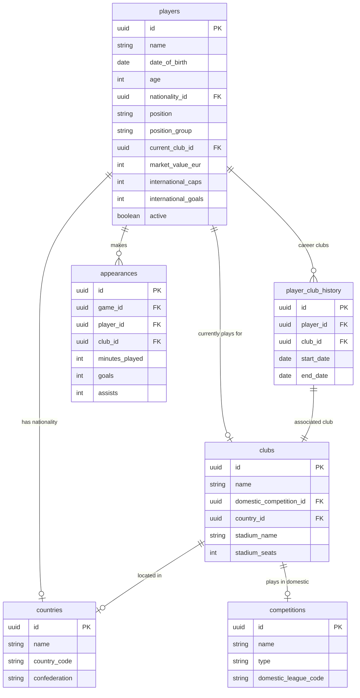

# You Know Ball? — Codebase Analysis & Architecture Guide

Welcome! This document provides a comprehensive breakdown of the **You Know Ball?** codebase. It outlines what the project is, how it is structured, and the step-by-step mechanisms of the game's execution flow.

---

## 1. Executive Summary & Concept

**You Know Ball?** is an AI-powered football deduction and trivia game. The core gameplay is inspired by social deduction games (like *20 Questions* or *Loldle*). 

- **The Objective**: Identify a hidden football player (randomly chosen from a pool of active players in the top 5 European leagues) by asking open-ended yes/no questions.
- **Natural Phrasing**: Instead of choosing from predefined options, players type natural language questions (e.g., *"Is he French?"*, *"Has he ever played for Real Madrid?"*, *"Does he play in the Premier League?"*).
- **Relational Ground Truth**: The game uses AI **only to interpret** the user's question, not to answer it. The system translates the query's intent into parameterized SQL statements executed against a highly structured, relational football database. This ensures 100% accuracy and eliminates LLM hallucinations.
- **Dynamic Elimination**: As hints are revealed, the system narrows down the list of matching active candidates, displaying the count of remaining possibilities to the user.

---

## 2. Directory Structure Overview

The repository is organized into a Next.js frontend, a Python-based backend, database seeding/management scripts, and project documentation:

```text
YouKnowBall/
│
├── .gitignore
├── .env                  # Global environment configuration (Supabase URL, GROQ API Key)
├── LICENSE
├── PRD.md                # Project Requirements Document
├── README.md             # Project Quickstart README
├── docker-compose.yml    # Runs local PostgreSQL container (fallback DB)
│
├── docs/                 # Project and design specifications
│   ├── API.md            
│   ├── PRD.md            
│   ├── architecture.md   
│   ├── gameplay.md       
│   └── schema.md         
│
├── scripts/              # Utility scripts for resetting and seeding database
│   ├── reset_db.py       
│   ├── seed_db.py        
│   └── setup.sh          
│
├── frontend/             # Next.js 16 Web Frontend (React 19 + TypeScript + Supabase SSR)
│   ├── .env.local        
│   ├── package.json      
│   ├── app/              
│   │   └── page.tsx      # Entrypoint utilizing Supabase client/server
│   ├── components/       # UI Components (progressive card reveals, leadboard)
│   ├── hooks/            
│   ├── lib/              
│   ├── styles/           
│   └── utils/            
│       └── supabase/     # Supabase auth, server, client configs
│
└── backend/              # Python FastAPI backend + Data Ingestion Engine
    ├── requirements.txt  # Python requirements (FastAPI, Groq, SQLAlchemy, Pandas)
    ├── play_game.py      # CLI Interactive Gameplay client
    ├── verify_database.py# Database connection and row counter verifier
    ├── verify_nlp.py     # NLP Parser validator (rule-based + Groq LLM)
    ├── verify_gameplay.py# Gameplay simulation verifier
    │
    └── app/              # Core application logic
        ├── main.py       # FastAPI application entrypoint (stubbed)
        │
        ├── db/           # Database module
        │   ├── database.py       # SQLAlchemy engine and session initializer
        │   ├── models/
        │   │   └── models.py     # SQLAlchemy ORM schemas mapping PostgreSQL tables
        │   ├── repositories/     # Database read/write managers (stubs)
        │   └── schemas/          # Pydantic schemas (stubs)
        │
        ├── nlp/          # Natural Language Processing & Query Parsing
        │   ├── parser.py         # Parsing orchestrator (Rules -> LLM Fallback)
        │   ├── regex_patterns.py # Layer 1: Local Regex parser (0ms latency, free)
        │   ├── normalizer.py     # Normalizes entities (e.g. Demonyms, aliases)
        │   └── llm/              # Layer 2: Groq client
        │       ├── groq_client.py# Groq API caller (Llama 3.1 8B Instant)
        │       ├── prompts.py    # Intent-classification system prompts
        │       ├── validators.py # JSON schema validators for LLM responses
        │       └── explainer.py  # Conversational response explainer
        │
        ├── game/         # Core game mechanics
        │   ├── queries/
        │   │   └── handlers.py   # Intent-to-SQL logic handlers
        │   └── candidate_engine/
        │       └── engine.py     # Candidate narrowing/elimination engine
        │
        ├── ingestion/    # Data pipelines
        │   ├── raw/              # Raw scraped Transfermarkt dataset CSVs
        │   ├── cleaned/          # Cleaned CSV outputs from pipeline
        │   └── scripts/          
        │       ├── clean_all.py  # Cleans raw CSVs & establishes FK integrity
        │       └── build_database.py # Inserts cleaned CSVs into PostgreSQL via COPY
        │
        └── normalization/
            ├── aliases.py        # Entity alias resolution dictionaries
            └── positions.py      # Transfermarkt detailed positions mapper
```

---

## 3. How It Works: Detailed Execution Flow

Here is the step-by-step lifecyle of a single gameplay turn in **You Know Ball?**:



### Step 1: Selecting the Hidden Player
When the session starts (e.g., in [play_game.py](file:///c:/Users/hamzz/Desktop/Github/YouKnowBall/backend/play_game.py#L24-L35)), the system selects a random player from the `players` table who is active, belongs to a club, and has a registered nationality:
```sql
SELECT p.id, p.name
FROM players p
JOIN clubs c ON p.current_club_id = c.id
JOIN countries nat ON p.nationality_id = nat.id
WHERE p.active = true
ORDER BY RANDOM()
LIMIT 1;
```

### Step 2: NLP Parsing Layer
When the player asks a question, [parser.py](file:///c:/Users/hamzz/Desktop/Github/YouKnowBall/backend/app/nlp/parser.py) orchestrates the parsing process:
1. **Layer 1: Rule-Based Parser** ([regex_patterns.py](file:///c:/Users/hamzz/Desktop/Github/YouKnowBall/backend/app/nlp/regex_patterns.py)): Matches inputs against pre-defined regex strings and maps them to standard terms (e.g., *"striker"* &rarr; `ATK`, *"english"* &rarr; `England`, *"barca"* &rarr; `FC Barcelona`). It does direct, minor SQL queries on competitions/clubs to check for simple string matches, running with 0ms API latency.
2. **Layer 2: LLM Fallback** ([groq_client.py](file:///c:/Users/hamzz/Desktop/Github/YouKnowBall/backend/app/nlp/llm/groq_client.py)): If rules do not match, the query goes to Groq using a structured prompt. The LLM extracts the question's target and intent, mapping it to a strict JSON structure:
   ```json
   {
     "type": "nationality" | "current_club" | "club_history" | "position" | "competition" | "invalid",
     "value": "string | null"
   }
   ```

### Step 3: Database Query Handler
The backend translates the parsed intent type and entity value into parameterized SQL queries in [handlers.py](file:///c:/Users/hamzz/Desktop/Github/YouKnowBall/backend/app/game/queries/handlers.py), validating against the hidden player's ID:
- **`nationality`**: Checks if the player's nationality matches the target.
- **`current_club`**: Compares `current_club_id` with the targeted club.
- **`club_history`**: Scans the `player_club_history` table for matches.
- **`position`**: Compares the player's broad position group (`GK`, `DEF`, `MID`, `ATK`).
- **`competition`**: Checks `appearances` table joined with `competitions` to see if they've registered minutes in a league or cup.

### Step 4: Candidate Filtering Engine
The [CandidateEngine](file:///c:/Users/hamzz/Desktop/Github/YouKnowBall/backend/app/game/candidate_engine/engine.py) maintains a set of all active players (`self.pool`). On every turn, it updates the pool using intersection/difference filters based on the database's answer:
- If answer is **`YES`**: Intersects pool with players matching the query.
- If answer is **`NO`**: Subtacts players matching the query from the pool.

### Step 5: Explainer host
The system calls [explainer.py](file:///c:/Users/hamzz/Desktop/Github/YouKnowBall/backend/app/nlp/llm/explainer.py) to generate a friendly, single-sentence response (e.g. *"Yes, the player played for Bayern Munich in the past."*). 
> [!IMPORTANT]
> The explainer system contains a post-processing filter that splits the target player's name and censors any matches found in the LLM's text output to guarantee that the host never leaks the player's identity prematurely.

---

## 4. Ingestion & Database Schema

The database relies on a highly detailed scraped Transfermarkt dataset (over 600MB of raw CSV files in `backend/app/ingestion/raw/transfermarkt`).

### The Data Cleaning Pipeline
Because database storage has a strict limit on cloud platforms (e.g., Supabase's free tier has a 500MB cap), [clean_all.py](file:///c:/Users/hamzz/Desktop/Github/YouKnowBall/backend/app/ingestion/scripts/clean_all.py) cleans the raw files:
1. **Filters Temporally**: Restricts players and matches to `season >= 2021` to discard dead historical records and reduce file sizes by ~80%.
2. **Maintains Referential Integrity**: Standardizes raw Transfermarkt integer IDs into UUIDs using SHA-1 namespace-hashing, and drops orphan child rows (appearances, games, events) where parent entries do not exist.
3. **Optimized in Memory**: Uses Pandas sets to track valid keys in memory for high-speed foreign key lookups.

### Database Insertion
[build_database.py](file:///c:/Users/hamzz/Desktop/Github/YouKnowBall/backend/app/ingestion/scripts/build_database.py) drops/recreates the tables using SQLAlchemy models, then performs high-speed `psycopg` `COPY` operations to load the CSVs into the remote database.

### Relational Schema Diagram
The core entity relationships are mapped out below:



---

## 5. Summary of Key Files

Here are links to the primary execution files:
- **Game Engine Core**:
  - [play_game.py](file:///c:/Users/hamzz/Desktop/Github/YouKnowBall/backend/play_game.py): The interactive CLI game client.
  - [engine.py](file:///c:/Users/hamzz/Desktop/Github/YouKnowBall/backend/app/game/candidate_engine/engine.py): The candidate elimination logic.
  - [handlers.py](file:///c:/Users/hamzz/Desktop/Github/YouKnowBall/backend/app/game/queries/handlers.py): Intent-to-SQL SQL query executor.
- **NLP & Parsing**:
  - [parser.py](file:///c:/Users/hamzz/Desktop/Github/YouKnowBall/backend/app/nlp/parser.py): Orchestrates parsing pipelines.
  - [regex_patterns.py](file:///c:/Users/hamzz/Desktop/Github/YouKnowBall/backend/app/nlp/regex_patterns.py): Regex matching and alias resolver.
  - [groq_client.py](file:///c:/Users/hamzz/Desktop/Github/YouKnowBall/backend/app/nlp/llm/groq_client.py): Fallback LLM client.
  - [explainer.py](file:///c:/Users/hamzz/Desktop/Github/YouKnowBall/backend/app/nlp/llm/explainer.py): Host commentator explainer.
- **Data Pipeline**:
  - [clean_all.py](file:///c:/Users/hamzz/Desktop/Github/YouKnowBall/backend/app/ingestion/scripts/clean_all.py): Data normalization and optimization script.
  - [build_database.py](file:///c:/Users/hamzz/Desktop/Github/YouKnowBall/backend/app/ingestion/scripts/build_database.py): CSV database populator.
- **ORM Schema mapping**:
  - [models.py](file:///c:/Users/hamzz/Desktop/Github/YouKnowBall/backend/app/db/models/models.py): Database tables representation.

---

## 6. Development Status & Stubs

While the gameplay loop, database schema, NLP parser, and ingestion pipeline are fully implemented and functional, several files are structured as placeholder stubs:
- `backend/app/db/repositories/` contains stubs (like `player_repository.py`) which could later be used to encapsulate database transactions in FastAPI.
- `backend/app/db/schemas/` contains Pydantic models (like `player_schema.py`) which would be used for request/response validation in a web server environment.
- `backend/app/services/` contains stubs for abstracting gameplay logic away from FastAPI controllers.
- `backend/app/main.py` is currently a stub representing the API entry point; the web API layer hasn't been built out yet.

The project is structured such that it can easily transition from local CLI testing to a production web application served via FastAPI and a Next.js frontend client.
